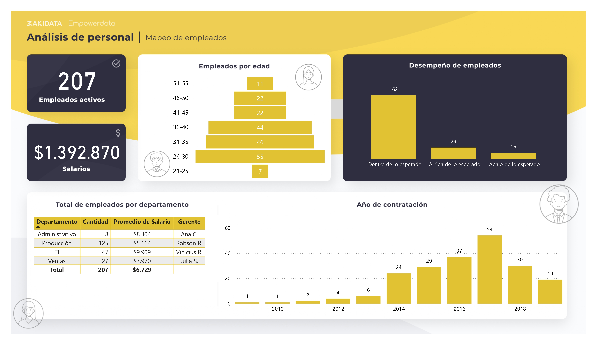

# 📊 Dashboard de Recursos Humanos  
Este repositorio contiene un Dashboard de Recursos Humanos desarrollado en Power BI, basado en un análisis detallado del personal de una empresa.

## 📂 Estructura del Repositorio  
- **📁 imagenes/** → Contiene la imagen del dashboard (`Dashboard-Recursos-Humanos.jpg`).  
- **📁 datos/** → Archivo original de la base de datos (`bd_integrantes_Esp.xlsx`).  
- **📊 Recursos-Humanos.pbix** → Archivo de Power BI con el dashboard final.  

## 🔍 Análisis Realizado  

### 1️⃣ Análisis Exploratorio  
- Se revisaron los datos originales para detectar inconsistencias.  

### 2️⃣ Transformación de Datos en Power Query  
- **Hoja 1 (Integrantes):**  
  - División de columnas en Excel.  
  - Cambio de nombres y tipos de datos.  
  - Eliminación de columnas innecesarias.  
  - Reemplazo de valores.  
- **Hoja 2 (Departamentos):**  
  - Cambio de encabezados.  
- **Integración de Tablas:** Relación entre empleados y departamentos.  

### 3️⃣ Medidas en DAX  
- **Cálculo de empleados activos:** `COUNT(ID)`  
- **Total de salarios:** `SUM(Salario)`  
- **Total de empleados por departamento:** Integración de tablas para análisis organizacional.  

### 4️⃣ Análisis de Desempeño  
- **Segmentación por edades:** Creación de la columna "Rango Edad" usando IA en Power Query.  

### 5️⃣ Visualizaciones Clave  
✔ **Gráfico de empleados por departamento**.  
✔ **Desempeño de empleados** con métricas relevantes.  
✔ **Distribución de empleados por edad** con el nuevo campo "Rango Edad".  
✔ **Evolución del personal por año de contratación**.  

## 🛠 Herramientas Utilizadas  
- **Power BI** → Creación del dashboard y visualización de datos.
- **Power Query** → Limpieza, transformación y modelado de datos.
- **DAX (Data Analysis Expressions)** → Cálculo de métricas clave como empleados activos y total de salarios.
- **Microsoft Excel** → Base de datos inicial con información de empleados y departamentos.

## 📸 Captura del Dashboard  
  

## 📌 Autor  

**Roberto Castillo**  
[GitHub](https://github.com/roberteban)  
